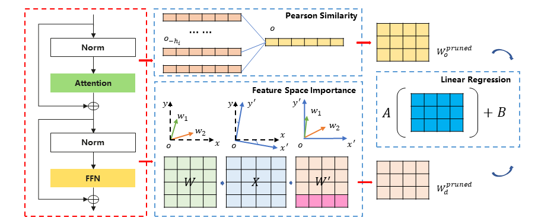
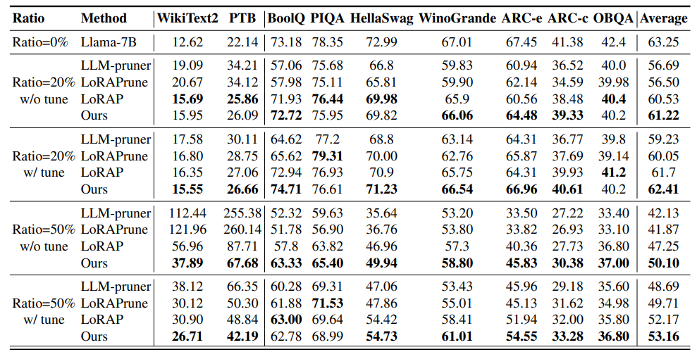

<div align="center">

<h3>[ICML 2025] SlimLLM: Accurate Structured Pruning for Large Language Models<h3>
</div>

<p align="center">
    
</p>


## Introduction
  
> **[SlimLLM: Accurate Structured Pruning for Large Language Models](https://arxiv.org/abs/2505.22689)** [[arXiv]](https://arxiv.org/abs/2505.22689)   
> *Jialong Guo, Xinghao Chen, Yehui Tang, Yunhe Wang*   
> *Huawei Noah’s Ark Lab, China*

#### Supported LLMs:
- [x] [Llama-2 Hugging Face](https://github.com/horseee/LLM-Pruner#1-pruning-discovery-stage--estimation-stage)
- [x] [LLaMA Hugging Face](https://github.com/horseee/LLM-Pruner#1-pruning-discovery-stage--estimation-stage)
- [x] [Vicuna](https://github.com/horseee/LLM-Pruner#llama-vicuna-pruning)

## Table of Contents
  - [Quick Start](#quick-start)
  - [Configuration of Pruning](#Configuration-of-Pruning)
  - [Zero-shot Evaluation](#zero-shot-evaluation)
  - [Acknowledgement](#acknowledgement)
  - [Citation](#citation)

## Quick Start

### Installation
```
pip install -r requirement.txt
```

### Minimal Example
```
bash script/llama_prune.sh
```
Executing this script would complete the pruning and post-training of the llama-7B at 20% and 50% ratios.

    
## Configuration of Pruning

### Pruning
    
:llama: **LLaMA/Llama-2 pruning with ~20% parameters pruned:**
```
python hf_prune.py --base_model llama-7b-hf \
       --pruning_ratio 0.25 \
       --device cpu  --eval_device cuda \
       --pruned_layers 26 \
       --alpha 10 \
       --save_ckpt_log_name prune_ckpt_path \
       --save_model
```
Arguments:
- ``--base_model``: The path of your model.
- ``--pruning_ratio``: The initial pruning ratio for each module.
- ``--pruned_layers``: The number of layers to be pruned in the model, and the IDs of the pruning layers will be automatically selected based on the calculated layer importance.
- ``--alpha``: The hyperparameter controlling the fluctuation of layer pruning ratio.
- ``--save_ckpt_log_name``: The path for save the checkpoint and the log.
- ``--device`` and ``--eval_device``: Pruning and evaluation can be performed on different devices. 

    
After pruning, we follow <a href="https://github.com/horseee/LLM-Pruner">LLM-Pruner</a> for post-training and evaluation.

## Zero-shot Evaluation

A brief quantitative results for LLaMA-7B:

<p align="center">
 <br>
</p>

More results can be found in the paper.

## Acknowledgement
* LLM-Pruner: <a href="https://github.com/horseee/LLM-Pruner">https://github.com/horseee/LLM-Pruner</a>
* SliceGPT: <a href="https://github.com/microsoft/TransformerCompression/tree/main/src/slicegpt">https://github.com/microsoft/TransformerCompression/tree/main/src/slicegpt</a>
* lm-evaluation-harness:  <a href="https://github.com/EleutherAI/lm-evaluation-harness">https://github.com/EleutherAI/lm-evaluation-harness</a>
* LLaMA: <a href="https://github.com/facebookresearch/llama"> https://github.com/facebookresearch/llama</a>
* Vicuna: <a href="https://github.com/lm-sys/FastChat">https://github.com/lm-sys/FastChat</a>

## Citation
If you find this project useful, please cite
```
@article{guo2025slimllm,
  title={SlimLLM: Accurate Structured Pruning for Large Language Models},
  author={Guo, Jialong and Chen, Xinghao and Tang, Yehui and Wang, Yunhe},
  journal={arXiv preprint arXiv:2505.22689},
  year={2025}
}
```
